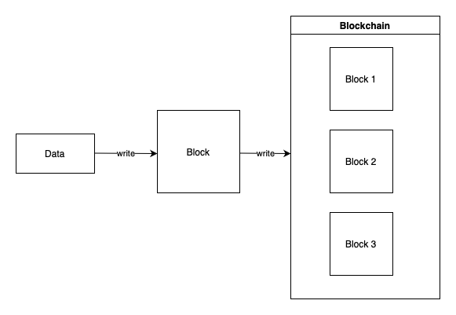

# Ledger Store


## Introduction

A blockchain is literally a database. But due to the complexity of usage of such a DB, several ways of adding the data to the DB, and reading it, were invented:

1. **Writing the data to a transaction.** 

   This is the simplest way of using the DB. The data written into a block, that goes then into a chain. This approach has one, but very big disadvantage: it is very hard to find the particular chain with a particular block containing the data you need:

   

2. **Smart contracts with the state of variables.** 

   While using this approach the user doesn't need to search for a particular block in a large blockchain, because a smart contract is a compact DB itself. 

   The most obvious disadvantage of such an approach is a smart contract itself, because the user needs to start a special transaction in a smart contract to write the data. This transaction starts a VM in the blockchain, where the special code will be executed to modify one variable with another or perform any other action, like deleting the variable, and so on. 

   The advantage of smart contracts is that the user always sure about how to write or read the data.

3. **LStore.** 

   It is an exclusive approach, invented by The Power Ecosystem. The idea of this approach is quite similar to that of working with smart contract, but the smart contract here is not used. LStore is a compact hierarchic kay-value DB bound to the user account, but when compared to the above-mentioned approach, the user doesn't need to have a VM and to use gas for smart contracts.

## LStore advantages

As we discussed above, LStore is a compact hierarchic key-value DB. Due to the hierarchic architecture of this DB, it allows user to create very complex data structures in a form of a tree.

LStore allows the user to:

1. Easily store the structured data in blockchain by sending the data to the user account.
2. Easily read the data. All users can read either all the data contained in LStore, or a specific batch of data, that can be received by a specific key.

The only disadvantage of LStore at the moment is that only a user that owns the account key can send the data into the account.

## Use-cases

Main use-case for LStore is creating hierarchic branches.

**Example**

```
main--------------------------
  \                           \
   tokens                   education
      \                         \
       token.address1        certificate.1
       token.address2        certificate.2
       token.address3        certificate.3
       ...                   ...
```

You can create a branch `main`. Under this branch you can create a subbranch named `tokens`, for instance, and then, under this branch, you can specify the token addresses you have. It makes it easier for you to find your tokens without needing to analyze each token address in a blockchain.

You can create multiple branches inside one main branch and place there any data you need.

You can also share the data in your branches with other users by giving them the link to either the main branch, or subbranches.

As you can see from the example above, LStore is fully scalable hierarchic DB.

## LStore working algorithm

LStore writing operation is performed according to the following algorithm:

1. LStore state changing transaction is sent to blockchain.
2. The LStore state in blockchain is changed.

LStore reading operation is performed according to the following algorithm:

1. Account address and LStore endpoint are sent to Power API.
2. User receives all needed LStore information. 

## LStore transaction examples

You can find an example of code by running the following command in `tp` CLI:

```bash
tp --example
```

The result will be a list of examples. You need to open `example_lstore.json` by running the following command:

```bash
% cat example_lstore.json
```

**Example**

```json
{
  "ver": 2,
  "kind": "lstore",
  "from": "AA100000006710886983",
  "t": "NOW",
  "seq": 2,
  "payload": [],
  "patches": [
    {"p": ["level1","level2","hello"], "t":"set", "v":"Hello, world"},
    {"p": ["level1","level2","bin1234"], "t":"set", "v":"0x010203"},
    {"p": ["level1","level2","list"], "t":"list_add", "v":"item1"},
    {"p": ["level1","level2","list"], "t":"list_add", "v":"item2"},
    {"p": ["level1","level2","list"], "t":"list_add", "v":"item3"}
  ]
}
```

where

- `"p"` — path. Here the levels in DB hierarchy must be specified;
- `"t"` — action. You can use `set`, `list_add`, `list_del`, `lists_cleanup`, and other;
- `"v"` — value.

:::note

In order to receive the data as specified above, just the account data needs to be read using its [endpoint](https://doc.thepower.io/docs/Build/api/api-reference/#addressaddress).

:::